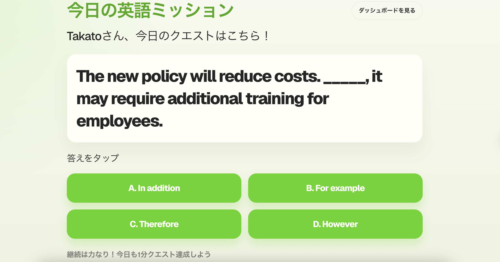

# Daily Study App



An app that helps users study something every day through a daily email challenge.

[https://daily-study-app-teal.vercel.app](https://budledge.dev/)

## Concept

Users receive a daily question by email.
They answer the question through a web interface and can challenge more questions.

## Features (MVP)

- Daily question email
- Multiple choice answers
- Explanation after answering
- Challenge more questions
- Learning progress dashboard

## Current dashboard metrics

- Total attempts
- Correct rate
- Category mix
- Current streak / longest streak
- Answer activity calendar

## Tech Stack (planned)

- Next.js
- TypeScript
- Supabase (PostgreSQL)
- Vercel
- Email API

## Environment Variables

Set these in `app/.env.local` for local development and in your hosting platform for production.

```env
DATABASE_URL="postgresql://..."
APP_BASE_URL="http://localhost:3000"
RESEND_API_KEY="re_xxxxxxxxxxxxxxxxx"
MAIL_FROM="Budledge <noreply@mail.budledge.dev>"
CRON_SECRET="your-shared-secret"
```

For production:

- set `APP_BASE_URL` to `https://budledge.dev`
- set `CRON_SECRET` in Vercel Production so scheduled requests can authenticate to `/api/cron/daily-question`
- set `RESEND_API_KEY` and `MAIL_FROM` in the same environment that should send daily emails

## Daily Email Delivery

- Vercel Cron triggers `GET /api/cron/daily-question` every day at `05:00 JST` (`20:00 UTC`).
- Set `CRON_SECRET` in Vercel so the cron endpoint is protected by `Authorization: Bearer <CRON_SECRET>`.
- Only users with `email_verified_at` set receive the daily email.
- The daily email includes the question text and all four choices directly in the HTML email.
- Each choice uses a single-use email answer link. The first click signs the user in, saves the answer, and redirects to the result screen.
- If the user opens the link again after it has already been consumed, the app shows that the link is already used and offers a challenge question instead.
- For manual testing, `GET /api/cron/daily-question` also supports `question_id` and `force_resend=true` query parameters.

### Required Production Settings

- `DATABASE_URL`
- `APP_BASE_URL`
- `RESEND_API_KEY`
- `MAIL_FROM`
- `CRON_SECRET`

If `CRON_SECRET` is missing in Vercel, the scheduled request can reach the endpoint but fail before any `DailyDelivery` rows are created.

### Manual Resend

If the scheduled delivery fails for a given day, you can retry it manually:

```bash
curl -i \
  -H "Authorization: Bearer <CRON_SECRET>" \
  "https://budledge.dev/api/cron/daily-question?force_resend=true"
```

After running it, confirm that the target user received the email and that `DailyDelivery.status` is `sent` for that `delivery_date`.

## Authentication Behavior

- The app uses email-link authentication.
- `User.email` is treated as the unique account key.
- Signing in with the same email address resumes the same learning history and dashboard data.
- For testing a clean first-time experience, use a different email address from existing test accounts.
