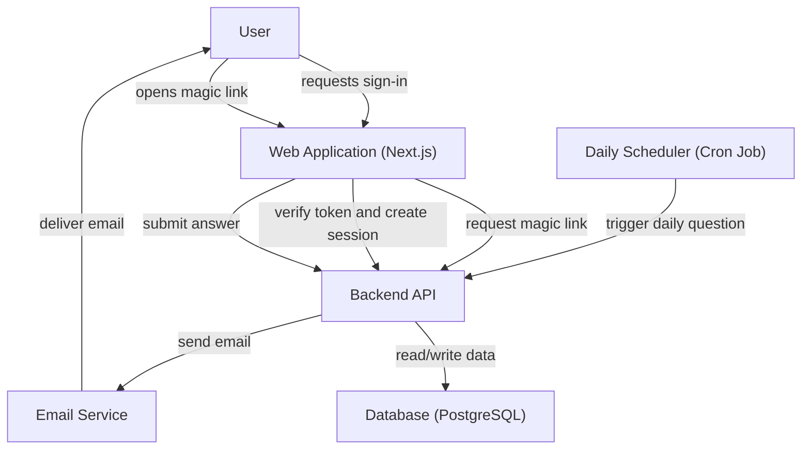

# System Architecture

This diagram shows the high-level architecture of the Daily Study App.

```mermaid
flowchart TD

User["User"] -->|requests sign-in| WebApp["Web Application (Next.js)"]
User -->|opens magic link| WebApp

Scheduler["Daily Scheduler (Cron Job)"] -->|trigger daily question| API["Backend API"]

WebApp -->|request magic link| API
API -->|send email| EmailService["Email Service"]

EmailService -->|deliver email| User

WebApp -->|verify token and create session| API
WebApp -->|submit answer| API

API -->|read/write data| Database["Database (PostgreSQL)"]
```
