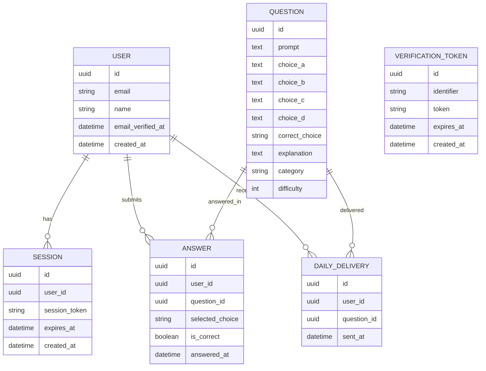

# ER Diagram

```mermaid
erDiagram

USER ||--o{ SESSION : has
USER ||--o{ ANSWER : submits
QUESTION ||--o{ ANSWER : answered_in
USER ||--o{ DAILY_DELIVERY : receives
QUESTION ||--o{ DAILY_DELIVERY : delivered

USER {
 uuid id
 string email
 string name
 datetime email_verified_at
 datetime created_at
}

SESSION {
 uuid id
 uuid user_id
 string session_token
 datetime expires_at
 datetime created_at
}

VERIFICATION_TOKEN {
 uuid id
 string identifier
 string token
 datetime expires_at
 datetime created_at
}

QUESTION {
 uuid id
 text prompt
 text choice_a
 text choice_b
 text choice_c
 text choice_d
 string correct_choice
 text explanation
 string category
 int difficulty
}

ANSWER {
 uuid id
 uuid user_id
 uuid question_id
 string selected_choice
 boolean is_correct
 datetime answered_at
}

DAILY_DELIVERY {
 uuid id
 uuid user_id
 uuid question_id
 datetime sent_at
}
```
