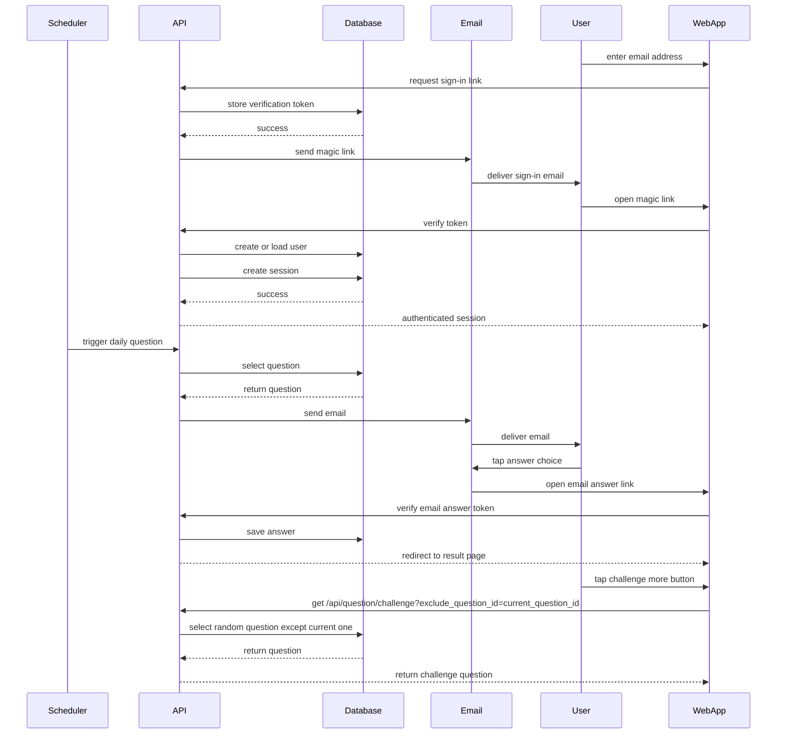

# Daily Question Flow

```mermaid
sequenceDiagram

participant Scheduler
participant API
participant Database
participant Email
participant User
participant WebApp

User->>WebApp: enter email address
WebApp->>API: request sign-in link
API->>Database: store verification token
Database-->>API: success
API->>Email: send magic link
Email->>User: deliver sign-in email
User->>WebApp: open magic link
WebApp->>API: verify token
API->>Database: create or load user
API->>Database: create session
Database-->>API: success
API-->>WebApp: authenticated session

Scheduler->>API: trigger daily question

API->>Database: select question
Database-->>API: return question

API->>Email: send email
Email->>User: deliver email

User->>Email: tap answer choice
Email->>WebApp: open email answer link
WebApp->>API: verify email answer token
API->>Database: save answer
API-->>WebApp: redirect to result page

User->>WebApp: tap challenge more button
WebApp->>API: get /api/question/challenge?exclude_question_id=current_question_id
API->>Database: select random question except current one
Database-->>API: return question
API-->>WebApp: return challenge question
```
