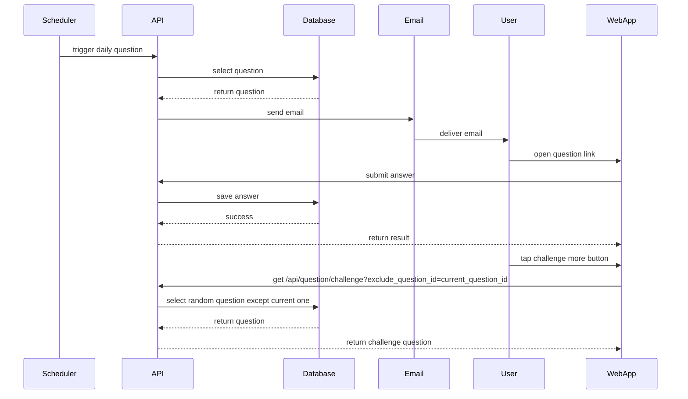

# Daily Question Flow

```mermaid
sequenceDiagram

participant Scheduler
participant API
participant Database
participant Email
participant User
participant WebApp

Scheduler->>API: trigger daily question

API->>Database: select question
Database-->>API: return question

API->>Email: send email
Email->>User: deliver email

User->>WebApp: open question link

WebApp->>API: submit answer

API->>Database: save answer
Database-->>API: success

API-->>WebApp: return result
User->>WebApp: tap challenge more button
WebApp->>API: get /api/question/challenge?exclude_question_id=current_question_id
API->>Database: select random question except current one
Database-->>API: return question
API-->>WebApp: return challenge question
```
